# Abstract

This report studies whether *class-conditional synthetic images* generated by a Conditional Generative Adversarial Network (CGAN) can improve downstream image classification when real labeled data are limited. A three-class fruit image dataset (apple, banana, orange) is used as a controlled benchmark. A CGAN with a **conditional batch-normalized generator** and a **projection discriminator** is trained to produce 64×64 RGB images. Generator checkpoints are evaluated with the **Fréchet Inception Distance (FID)** on a held-out validation split, and a synthetic image pool is generated from the best-performing checkpoint. The downstream utility of synthetic data is assessed by training a compact convolutional classifier (FruitCNN) under three scenarios—real-only, synthetic-only, and real+synthetic—across multiple data sizes (100–1300 images per class).

Results show that the CGAN achieves its best recorded validation FID at epoch 140 (**FID ≈ 143.36**). For classification, real-only training already yields near-ceiling accuracy (≈98.6–99.9%) even with 100 images per class, reflecting an “easy” dataset regime. Adding synthetic images sometimes improves or matches performance (e.g., at 400 images/class, real+synthetic reaches **99.66%** vs **98.37%** for real-only), but provides limited gains when real data are abundant. Training on synthetic data alone generalizes poorly to real test images (accuracy drops to **69.58%** at 1300 images/class), indicating a substantial domain gap and underscoring that low FID does not guarantee downstream utility. The report concludes with limitations (single seed, small class set, single architecture) and a roadmap for more robust evaluation (multi-seed experiments, stronger GAN baselines, per-class metrics, and improved synthetic–real alignment).

# Executive Summary

**Goal.** Determine whether CGAN-generated synthetic images can supplement real fruit images to improve classification performance under varying data availability.

**Approach.**

- Train a **conditional GAN** (CGAN) on a 3-class fruit dataset (apple/banana/orange).
- Monitor training with **FID** and qualitative sample grids.
- Generate a balanced synthetic pool from the best-FID checkpoint.
- Train the same classifier across a **data-size grid** in three scenarios:
  1) real-only, 2) synthetic-only, 3) real+synthetic.

**Key findings.**

- **GAN quality trend:** FID decreases substantially over training and reaches its best value at epoch 140 (FID ≈ 143.36), then degrades slightly by epoch 200.
- **Downstream utility:** Synthetic augmentation provides **limited benefits** because real-only accuracy is already very high at small data sizes on this dataset.
- **Domain gap:** Synthetic-only training does not transfer well to real test images, suggesting that the generator distribution differs meaningfully from the real distribution despite improvements in FID.

**Takeaway.** Synthetic data are most credible as a *supplement* to real data, not a replacement, and must be evaluated with downstream tasks and robustness checks (multi-seed, stronger baselines) rather than relying on a single image-quality metric.

**Reproducibility.** All figures and tables used in this report are exported into `reports/figures/` and `reports/tables/` and can be regenerated from repository artifacts (Appendix A).

# Table of Contents

1. [Introduction](#1-introduction)  
2. [Background & Related Work](#2-background--related-work)  
3. [Dataset & Preprocessing](#3-dataset--preprocessing)  
4. [Methodology](#4-methodology)  
5. [Experimental Design](#5-experimental-design)  
6. [Results](#6-results)  
7. [Discussion](#7-discussion)  
8. [Limitations](#8-limitations)  
9. [Future Work](#9-future-work)  
10. [Conclusion](#10-conclusion)  
11. [References](#references)  
12. [Appendix A — Reproducibility](#appendix-a--reproducibility)  
13. [Appendix B — Hyperparameters](#appendix-b--hyperparameters)  
14. [Appendix C — Repository Structure](#appendix-c--repository-structure)  

# 1. Introduction

Deep learning systems often benefit from large labeled datasets, but real-world data collection and labeling are expensive, time-consuming, and sometimes constrained by privacy or access. **Synthetic data generation** offers a potential remedy: if a generative model can produce images that resemble the real distribution, these images can be used to train or augment downstream models.

However, synthetic augmentation is not guaranteed to help. Even visually plausible images may encode artifacts that a classifier can exploit in training but which do not exist at test time, causing poor generalization. Therefore, any synthetic pipeline should be evaluated not only with intrinsic image metrics (e.g., FID) but also with **task-based evaluations** such as downstream accuracy and per-class performance.

This work focuses on a small, controlled classification task (three fruits) to study:

1. Whether a CGAN can learn a class-conditional distribution for apples, bananas, and oranges.
2. How the generator’s training dynamics relate to an intrinsic quality measure (FID).
3. Whether synthetic data improve classification performance under limited real data.

**Scope.** The report is an engineering-focused empirical study using the existing repository code and outputs (training logs and plots under `runs/`). The goal is not to claim state-of-the-art results, but to provide a rigorous, thesis-level analysis of the implemented pipeline, its results, and its limitations.

## 1.1 Research questions

To keep the evaluation decision-oriented, the study is organized around the following research questions (RQs):

- **RQ1 (Generative quality).** Does the implemented CGAN learn a non-trivial class-conditional image distribution, as evidenced by improving FID and qualitatively improving sample grids during training?
- **RQ2 (Downstream utility).** When training data are limited, does adding synthetic images improve classifier generalization on a real test set compared to training on real data alone?
- **RQ3 (Metric–utility alignment).** Do improvements in intrinsic generative metrics (FID) correspond to improvements in downstream classification utility, and under what conditions do they diverge?

## 1.2 Contributions

Although the dataset and models are intentionally small, the pipeline is complete and empirically evaluated. The main contributions are:

- An end-to-end implementation of **conditional image synthesis** using a projection-discriminator CGAN (`models/gan.py`, `train_gan.py`).
- A **reproducible experiment grid** for measuring downstream impact across data sizes and training scenarios (`train_classifier.py`, `scripts/run_experiments.py`).
- A self-contained report bundle with **copied figures** and **exported CSV tables** under `reports/`, plus stdlib-only scripts to regenerate the report artifacts.

# 2. Background & Related Work

## 2.1 Generative Adversarial Networks (GANs)

GANs learn a generative model through an adversarial game between a generator \(G\) and a discriminator \(D\). In the original formulation, \(G\) maps random noise \(z\) to a synthetic image \(x = G(z)\), while \(D(x)\) estimates whether \(x\) is real or synthetic. Training is typically based on a minimax objective. In practice, many implementations use a **non-saturating** generator loss to stabilize gradients.

### Practical training issues

GAN optimization is well known to be unstable. Common failure modes include:

- **Mode collapse:** the generator produces limited varieties of images (low diversity) while still fooling the discriminator.
- **Discriminator dominance:** if \(D\) becomes too strong early, the generator gradients can become uninformative.
- **Oscillatory dynamics:** the game does not converge smoothly; improvements can be non-monotonic.

In this repository’s implementation, several pragmatic stabilizers are used:

- Adam with \((\beta_1, \beta_2) = (0.5, 0.999)\),
- a slightly higher generator learning rate than discriminator learning rate,
- and gradient clipping (`max_norm=1.0`) for both networks.

These choices are not theoretically optimal in general, but they are reasonable engineering defaults for DCGAN-style training.

## 2.2 Conditional GANs

Conditional GANs (CGANs) extend the GAN framework by conditioning on a class label \(y\). This enables class-controlled generation \(x = G(z, y)\) and a discriminator \(D(x, y)\) that evaluates authenticity *given the label*. Conditioning can be injected in multiple ways: concatenation, conditional batch normalization, or conditional discriminators.

In the implemented pipeline, conditioning is applied in **both** networks:

- The generator uses **conditional batch normalization**, allowing class information to modulate intermediate feature statistics.
- The discriminator uses a **projection term** that aligns image features with a class embedding.

Conditioning both sides is important: if the generator is strongly class-conditioned but the discriminator ignores the label, the generator may be incentivized to ignore the label as well.

## 2.3 Projection Discriminator

A projection discriminator conditions on \(y\) by projecting learned image features onto an embedding of the class label. If \(h(x)\) is the discriminator feature representation, the conditional logit can be written as:

\[
D(x, y) = w^\top h(x) + \langle e(y), h(x) \rangle,
\]

where \(w\) is an unconditional classifier vector and \(e(y)\) is a learned embedding for class \(y\). This approach is widely used in modern conditional GANs because it provides a strong conditioning mechanism without requiring the discriminator to receive label maps as explicit inputs.

Intuitively, the projection term increases the score when the image features “look compatible” with the label embedding. This tends to encourage class-consistent generation without forcing the discriminator to learn a separate classifier head.

**Note.** Many projection-discriminator implementations also apply **spectral normalization** to stabilize the discriminator. The current implementation does not include spectral normalization; instead, it relies on learning-rate tuning and gradient clipping.

## 2.4 Fréchet Inception Distance (FID)

FID is a widely used metric for evaluating generative models. It compares real and generated images by embedding them into a feature space (often InceptionV3 features) and approximating each set as a multivariate Gaussian. The distance between these Gaussians is:

\[
\mathrm{FID} = \|\mu_r - \mu_g\|_2^2 + \mathrm{Tr}\left(\Sigma_r + \Sigma_g - 2(\Sigma_r \Sigma_g)^{1/2}\right).
\]

Lower values indicate closer agreement between real and generated feature distributions. Importantly, FID is **not a task metric**, and it can be sensitive to sample size, preprocessing, and the suitability of the feature extractor for the domain.

### Limitations of FID in this setting

FID is helpful for monitoring training progress, but several factors limit its interpretability here:

- **Small evaluation split.** The configured sample count is larger than the available validation images (477), so FID is computed on fewer samples than intended.
- **Domain mismatch of the feature extractor.** InceptionV3 is trained on ImageNet; its feature geometry may not perfectly reflect perceptual similarity for this fruit dataset.
- **Mixture vs per-class distributions.** Computing FID on the union of all classes can hide class-conditional failures (e.g., one class collapsing).

For these reasons, the report treats FID as a *supporting signal* and prioritizes downstream evaluation on the real test set.

## 2.5 Synthetic Augmentation in Practice

Synthetic augmentation is most beneficial when:

- The real dataset is small or imbalanced.
- The synthetic distribution improves coverage (diversity) rather than memorizing a subset.
- The downstream model is robust to synthetic artifacts (or those artifacts are minimal).

In practice, synthetic augmentation competes with (and may complement) strong *classical* augmentation baselines such as geometric transforms and color perturbations. On many vision tasks, classical augmentation can already yield large generalization gains, particularly in low-data regimes. Therefore, a careful evaluation should contextualize any synthetic gains against these baselines.

Another recurring practical lesson is that synthetic augmentation tends to be most reliable when synthetic images are used as **additional signal** rather than the sole training distribution. Mixed-domain training (real+synthetic) provides an anchor to the real data manifold and reduces the risk that a classifier learns synthetic-specific shortcuts.

This report evaluates synthetic augmentation with both intrinsic (FID) and extrinsic (classification) metrics to quantify whether synthetic images actually help.

## 2.6 Evaluating synthetic data for downstream tasks

When the goal of synthetic generation is to improve a downstream model, the evaluation should match that goal. Two common protocols are:

- **Train on synthetic, test on real (TSTR).** Measures whether synthetic data can replace real data for training. This is a strict test of domain alignment and is typically difficult to satisfy.
- **Train on real+synthetic, test on real.** Measures whether synthetic data provide incremental signal beyond real training data. This is often the most practical augmentation scenario.

This report includes both perspectives: the **synthetic-only** scenario corresponds to TSTR, and the **real+synthetic** scenario corresponds to augmentation. Reporting both is important because a method that fails at TSTR can still help as an augmentor, while a method that appears strong visually may still fail at TSTR due to subtle distribution shifts.

# 3. Dataset & Preprocessing

## 3.1 Dataset overview

The dataset is a Fruits-360-like image collection organized as an `ImageFolder`-compatible directory structure:

- `data_final/train/{apple,banana,orange}`
- `data_final/val/{apple,banana,orange}`
- `data_final/test/{apple,banana,orange}`

The raw images are 100×100 pixels (verified via system tooling), and the training pipeline resizes them to **64×64** to match the generator and classifier architectures.

### Class balance and split integrity

All three classes are perfectly balanced within each split (Table in Section 3.1), which simplifies interpretation: accuracy changes are less likely to be driven by class imbalance.

The code assumes that the split directories (`train/`, `val/`, `test/`) contain disjoint images. The directory-based split helps prevent leakage, but this report does not perform hash-based duplicate detection across splits; thus, strict non-overlap is an assumption.

### Split sizes

Exact image counts (exported in `reports/tables/dataset_summary.csv`) are:

| Split | Apple | Banana | Orange | Total |
|---:|---:|---:|---:|---:|
| train | 1300 | 1300 | 1300 | 3900 |
| val | 159 | 159 | 159 | 477 |
| test | 492 | 492 | 492 | 1476 |

## 3.2 Real vs synthetic examples

To make the real–synthetic gap tangible, the report includes deterministic exemplar images.

**Real exemplars** (lexicographically first file per class from `data_final/train/...`):

| Apple | Banana | Orange |
|---|---|---|
| 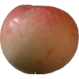 |  | 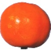 |

**Synthetic exemplars** (`*_synth_00000.png` from `data_synth/...`):

| Apple | Banana | Orange |
|---|---|---|
| 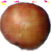 | 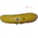 | 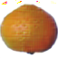 |

These single examples are not sufficient for evaluation, but they help qualitatively interpret the quantitative results.

## 3.3 Preprocessing and augmentation

### GAN training transforms

GAN training uses:

- Resize to 64×64
- Random horizontal flip (training only)
- Tensor conversion + normalization to \([-1, 1]\) using mean=0.5, std=0.5 per channel

FID evaluation uses the same resize and normalization but disables augmentation.

### Classifier training transforms

The classifier is trained with stronger augmentation:

- Resize to 64×64
- Random horizontal flip
- Random rotation up to ±15°
- Color jitter (brightness and contrast)
- Tensor conversion + normalization to \([-1, 1]\)

Test-time evaluation uses only resize + normalization.

# 4. Methodology

## 4.1 Conditional GAN architecture

The CGAN is implemented in `models/gan.py` and trained in `train_gan.py`. It consists of:

1. A **Generator** that maps \((z, y)\) to a 64×64 RGB image.
2. A **Projection Discriminator** that scores whether an image is real given its class label.

### 4.1.1 Generator (conditional batch normalization)

The generator begins with a linear projection of a noise vector \(z \in \mathbb{R}^{128}\) into a 4×4 feature map. It then applies four upsampling blocks to reach 64×64 resolution. Each block uses:

- Upsample ×2 (nearest-neighbor upsampling)
- 3×3 convolution
- **Conditional BatchNorm2d**, where \(\gamma(y)\) and \(\beta(y)\) are learned embeddings of the class label
- ReLU activation

The final “to RGB” stage applies batch norm, ReLU, a 3×3 convolution to 3 channels, and **tanh** to produce outputs in \([-1, 1]\).

### 4.1.2 Discriminator (projection conditioning)

The discriminator uses a stack of convolutional residual-like blocks with average pooling for downsampling:

- 64×64 → 32×32 → 16×16 → 8×8 → 4×4

After the final block, it applies a leaky ReLU and **global sum pooling** over spatial dimensions to obtain a feature vector \(h(x)\). The final logit is:

\[
\ell(x, y) = \underbrace{w^\top h(x)}_{\text{unconditional}} + \underbrace{\langle e(y), h(x) \rangle}_{\text{projection}}.
\]

This logit is passed to `BCEWithLogitsLoss` without an explicit sigmoid layer.

## 4.2 GAN training procedure

GAN training follows a classic alternating update scheme:

- **One discriminator step** per batch
- **One generator step** per batch

Losses are implemented via `BCEWithLogitsLoss`:

- Discriminator real targets: 1
- Discriminator fake targets: 0
- Generator targets: 1 (non-saturating objective: fool the discriminator)

### Loss functions (logit form)

Let the discriminator output a raw logit \(s = D(x, y)\). Using the numerically stable `BCEWithLogitsLoss` corresponds to the following per-sample terms:

- For a real sample (target 1): \(\ell_{\text{real}} = \log(1 + \exp(-s)) = \mathrm{softplus}(-s)\)
- For a fake sample (target 0): \(\ell_{\text{fake}} = \log(1 + \exp(s)) = \mathrm{softplus}(s)\)

With these definitions, the implemented losses correspond to:

\[
\mathcal{L}_D = \mathbb{E}_{(x,y)\sim p_{\text{data}}}\left[\mathrm{softplus}(-D(x,y))\right] + \mathbb{E}_{z,y}\left[\mathrm{softplus}(D(G(z,y),y))\right],
\]

and the non-saturating generator loss:

\[
\mathcal{L}_G = \mathbb{E}_{z,y}\left[\mathrm{softplus}(-D(G(z,y),y))\right].
\]

This formulation matches the “target=1” generator objective implemented in the training code.

### Update details (as implemented)

The discriminator and generator updates are not purely symmetric; the specific conditioning choices matter:

- **Discriminator step.** Fake images are generated using the *real batch labels* \(y_{\text{real}}\). This forces the discriminator to evaluate real-vs-fake *at the same conditional label* for each sample.
- **Generator step.** Labels are sampled uniformly at random. This encourages the generator to model all classes and not only mimic the label distribution in a particular batch.

In pseudocode (per minibatch):

1. Sample a real minibatch \((x_{\text{real}}, y_{\text{real}})\).
2. Generate \(x_{\text{fake}} = G(z, y_{\text{real}})\) for discriminator training.
3. Update \(D\) to classify \(x_{\text{real}}\) as real and \(x_{\text{fake}}\) as fake.
4. Sample random labels \(y \sim \mathrm{Unif}(\{1..K\})\), generate \(x_{\text{fake}} = G(z, y)\).
5. Update \(G\) to make \(D(x_{\text{fake}}, y)\) predict “real”.

Optimization uses Adam with betas \((0.5, 0.999)\), a common choice in DCGAN-style training. To reduce instability, **gradient clipping** is applied to both networks with `max_norm=1.0`.

The training loop periodically:

- Saves sample grids (`samples_epochXXXX.png`) for qualitative monitoring
- Saves checkpoints (`ckpt_epochXXXX.pt`)
- Computes FID every `fid_every` epochs on a fixed evaluation split

Qualitative sample grids are generated from a fixed set of latent vectors and labels (8 samples per class). Using fixed inputs reduces visual “jitter” and makes it easier to attribute changes in sample quality to training progress rather than random sampling variation.

### Checkpoint selection

Whenever an evaluated checkpoint improves the best recorded FID, it is saved as `runs/gan/checkpoints/best_fid.pt`. This report uses that selection rule for synthetic pool generation, ensuring that the synthetic dataset corresponds to the best intrinsic metric observed during training (subject to the limitations of FID discussed earlier).

## 4.3 FID computation details (as implemented)

FID is computed in `train_gan.py` using:

- Feature extractor: InceptionV3 with ImageNet weights (`IMAGENET1K_V1`)
- Output: 2048-d “pool3” features (implemented by replacing the final FC with identity)
- Preprocessing:
  - Generator outputs in \([-1,1]\) are rescaled to \([0,1]\)
  - Then normalized with ImageNet mean/std
  - Resized to 299×299 before feeding into InceptionV3

The covariance matrix square root \((\Sigma_r \Sigma_g)^{1/2}\) is computed using `scipy.linalg.sqrtm`. Numerical errors can introduce small imaginary components; the implementation discards the imaginary part when it occurs, which is a common practical handling strategy in FID implementations.

The mean and covariance are estimated from finite samples using NumPy (`mean` and `np.cov`). By default, `np.cov` uses the sample covariance normalization (approximately \(1/(N-1)\)), which is standard in many FID implementations. However, when \(N\) is small (as in the 477-image validation split), covariance estimates can be noisy, contributing to non-monotonic FID curves.

**Important practical note.** The configuration requests `fid_n_samples=2048`, but the validation split contains only **477** images. Therefore, each FID evaluation uses **477 real + 477 generated** images in this setup. This can increase variance and means the absolute FID values should be interpreted cautiously; the primary signal is the *trend* and relative comparisons across epochs.

## 4.4 Synthetic pool generation

Synthetic images are generated using `scripts/generate_synth.py` by loading a trained generator checkpoint and sampling \(z \sim \mathcal{N}(0, I)\) with class labels \(y \in \{0,1,2\}\). The output pool is stored in:

- `data_synth/{apple,banana,orange}/...png`

For the downstream experiments, the synthetic pool is balanced across classes.

In the current repository state, the synthetic pool contains **1300 images per class** (3900 total), matching the full size of the real training split. Synthetic images are saved as PNG files with normalization parameters chosen so that pixel values correspond to the generator’s \([-1,1]\) output range when visualized.

## 4.5 Downstream classifier

The classifier (`models/classifier.py`) is a small convolutional neural network (FruitCNN) with:

- Repeated Conv → BatchNorm → ReLU layers
- MaxPool downsampling
- Dropout for regularization
- A 256-unit fully connected layer and a final linear classifier

Training uses cross-entropy loss, Adam optimizer, and a cosine annealing learning rate schedule.

The classifier is intentionally modest in capacity to make data-size effects visible and to reduce the chance that results are dominated by overparameterization. Dropout is applied both in the convolutional stack (Dropout2d) and in the fully connected head to regularize training across all scenarios.

## 4.6 Reproducibility considerations

The repository is designed to be reproducible at a practical level (fixed seeds and deterministic subsampling), but strict determinism is not guaranteed:

- **Random seeds.** `train_gan.py` seeds Python `random`, NumPy, and PyTorch. `train_classifier.py` seeds Python `random` and PyTorch. The deterministic subsampling by class uses `seed=42`.
- **Data loading.** Multi-worker data loading can introduce subtle nondeterminism unless worker seeds and deterministic algorithms are enforced.
- **Hardware backend.** The default device is Apple Silicon MPS when available. Some backend operations can be nondeterministic across runs or across software versions.

For a thesis-grade evaluation, the recommended practice is to run multiple seeds and report aggregate statistics (mean ± standard deviation) rather than relying on exact bitwise reproduction.

# 5. Experimental Design

## 5.0 Hypotheses

Before running experiments, the following hypotheses guide interpretation:

- **H1 (FID trend).** FID should decrease over training and reach a minimum in mid-to-late epochs, potentially followed by non-monotonic fluctuations.
- **H2 (augmentation utility).** Real+synthetic training should match or slightly improve real-only performance at smaller \(N\), where additional variability can act as a regularizer, but show diminishing returns at large \(N\) due to saturation.
- **H3 (synthetic-only gap).** Synthetic-only training should underperform on the real test set due to synthetic–real distribution shift, even when synthetic images appear visually plausible.

## 5.1 Experiment A: GAN training monitoring

Purpose:

1. Track FID as a coarse intrinsic quality indicator.
2. Inspect qualitative sample grids to identify mode collapse, artifacts, or class confusion.

Artifacts:

- `runs/gan/train_log.json` (per-epoch losses, and FID every `fid_every` epochs)
- `runs/gan/samples_epochXXXX.png` (fixed-noise qualitative tracking)

## 5.2 Experiment B: Downstream data-size study

Purpose: quantify whether synthetic data improve classification performance as training data vary.

### Scenarios

- **Real only** (`scenario=real`): train on real images only.
- **Synth only** (`scenario=synth`): train on synthetic images only.
- **Real + Synth** (`scenario=both`): train on the concatenation of real and synthetic (matched counts per class when subsampling).

### Data sizes

Each run uses **N images per class**, with:

\[
N \in \{100, 200, 400, 800, 1300\}.
\]

When subsampling is enabled, a deterministic class-balanced subset is selected using `seed=42`.

### Evaluation protocol and fairness considerations

All scenarios are evaluated on the **same real test split** (`data_final/test`). This is important: the synthetic-only scenario is effectively a **domain transfer** test (train on synthetic, test on real). The real+synthetic scenario tests whether synthetic images provide additional useful signal beyond the real training set.

The training schedule (number of epochs) is held constant across runs. As a result, the total number of optimization steps increases with dataset size and is largest for the real+synthetic scenario (because its dataset is larger). Training time is therefore reported alongside accuracy to make the accuracy–cost trade-off explicit.

### Metrics

- Primary: test accuracy on `data_final/test`
- Secondary: per-class precision/recall/F1 (from `sklearn.metrics.classification_report`)
- Cost: training time (seconds)

All experiment results are stored as JSON in `runs/clf/` and aggregated into `runs/clf/all_results.json` (exported to `reports/tables/clf_results.csv`).

# 6. Results

## 6.1 GAN intrinsic quality (FID)

### FID vs epoch

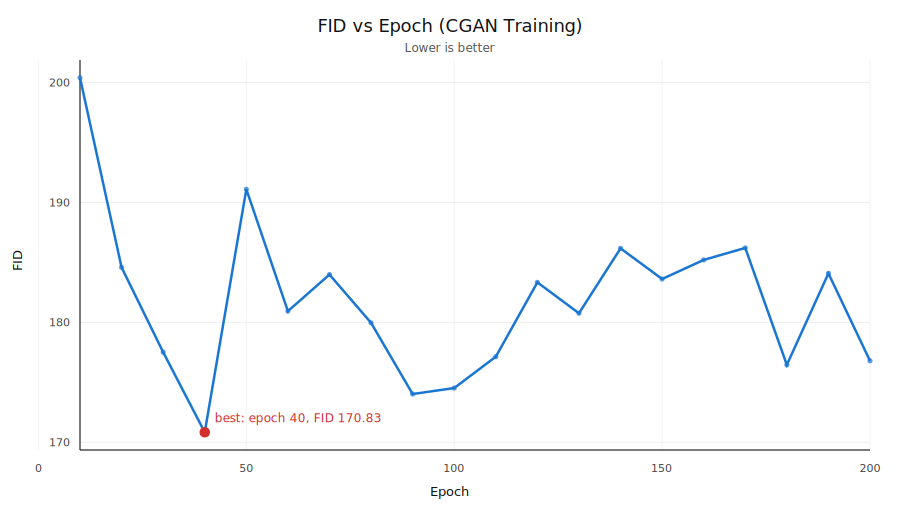

Selected FID values at key epochs (from `reports/tables/gan_fid_by_epoch.csv`):

| Epoch | FID |
|---:|---:|
| 10 | 212.84 |
| 50 | 189.84 |
| 100 | 149.97 |
| 140 (best) | 143.36 |
| 200 | 153.14 |

**Interpretation.** The sharp FID decrease from epoch 10 to epoch 140 suggests the generator improves substantially over training. The slight FID increase by epoch 200 indicates either mild overfitting, reduced diversity, or measurement noise due to limited evaluation sample size.

### Qualitative progression (fixed noise, fixed labels)

| Epoch 1 | Epoch 50 |
|---|---|
| 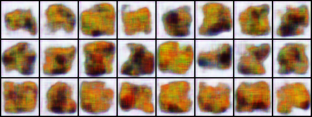 | 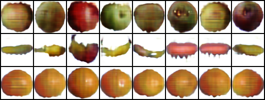 |

| Epoch 140 (best FID) | Epoch 200 |
|---|---|
| 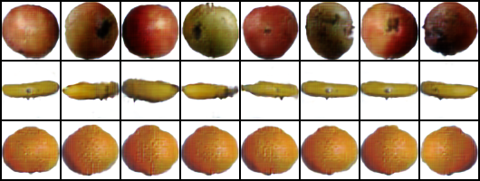 | 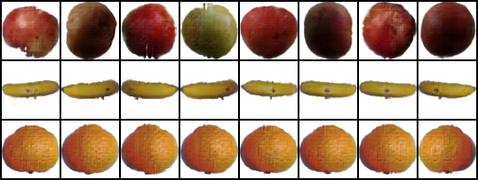 |

Qualitative grids provide complementary evidence to FID and help detect failure modes that a single scalar metric may miss.

## 6.2 Downstream classification (utility of synthetic data)

### Accuracy vs training data size

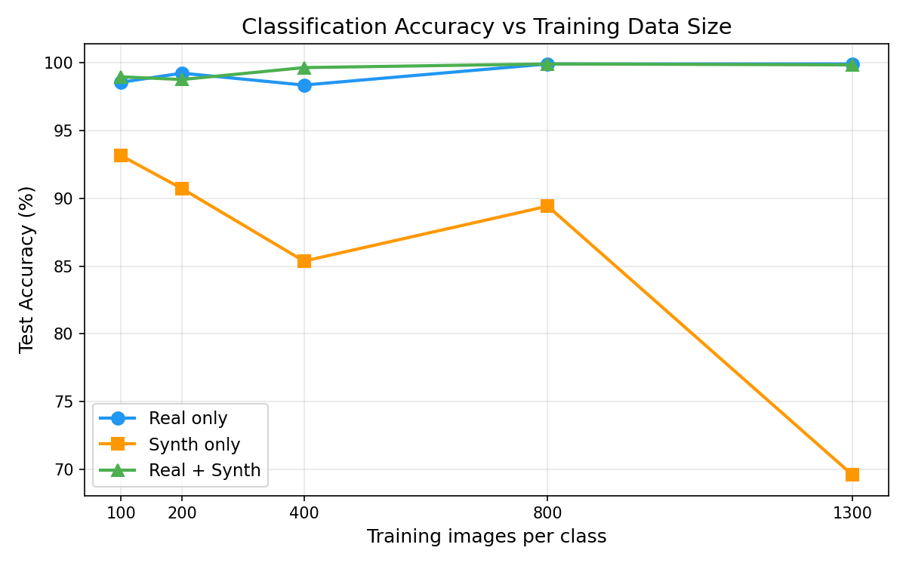

The central quantitative result is summarized below (test accuracy; higher is better).

| Images per class (N) | Real only | Synth only | Real + Synth |
|---:|---:|---:|---:|
| 100 | 98.58% | 93.16% | 98.98% |
| 200 | 99.25% | 90.72% | 98.78% |
| 400 | 98.37% | 85.37% | 99.66% |
| 800 | 99.93% | 89.43% | 99.93% |
| 1300 | 99.93% | 69.58% | 99.86% |

**Observation 1 (Ceiling effect).** Real-only accuracy is already very high at \(N=100\), leaving limited headroom for synthetic augmentation.

**Observation 2 (Mixed results for augmentation).** Real+synthetic sometimes improves performance (notably at \(N=400\)), but also slightly underperforms real-only at some sizes (e.g., \(N=200\)).

**Observation 3 (Synthetic-only domain gap).** Synthetic-only training does not transfer reliably to the real test set and degrades sharply at \(N=1300\).

### Augmentation effect size (Real+Synth minus Real)

To highlight where synthetic augmentation helps most, Table below reports \(\Delta\) accuracy in percentage points:

| Images per class (N) | Δ Accuracy (Both − Real) |
|---:|---:|
| 100 | +0.40 pp |
| 200 | −0.47 pp |
| 400 | +1.29 pp |
| 800 | +0.00 pp |
| 1300 | −0.07 pp |

The largest observed gain occurs at **N=400**, suggesting that synthetic images can provide useful additional variability in a mid-data regime. In the largest-data regime, the real model is already saturated, and synthetic augmentation is neutral to slightly negative.

### Computational cost

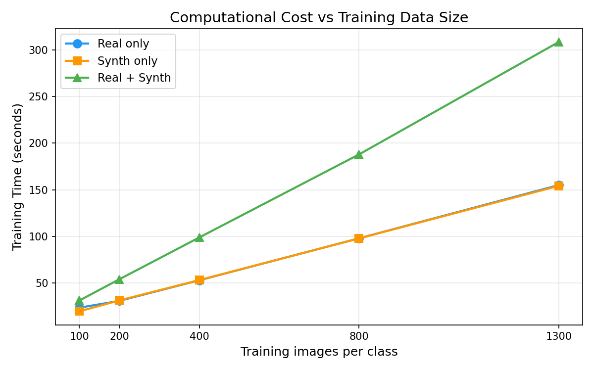

Training time grows roughly linearly with dataset size, and the **real+synthetic** scenario is most expensive because it doubles the training set when both subsets are included.

| Images per class (N) | Real time (s) | Synth time (s) | Both time (s) |
|---:|---:|---:|---:|
| 100 | 23.6 | 19.7 | 31.3 |
| 200 | 30.9 | 31.4 | 54.1 |
| 400 | 53.0 | 53.2 | 98.9 |
| 800 | 98.0 | 97.9 | 188.0 |
| 1300 | 155.1 | 154.3 | 308.6 |

### Cost-adjusted view of synthetic augmentation

Because real+synthetic uses more training data, it also requires substantially more compute. A concise way to summarize the trade-off is to compare real+synthetic against real-only at each data size:

| Images per class (N) | Δ Accuracy (Both − Real) | Δ Time (s) (Both − Real) | Time ratio (Both/Real) |
|---:|---:|---:|---:|
| 100 | +0.40 pp | +7.7 | 1.33× |
| 200 | −0.47 pp | +23.2 | 1.75× |
| 400 | +1.29 pp | +45.9 | 1.87× |
| 800 | +0.00 pp | +90.0 | 1.92× |
| 1300 | −0.07 pp | +153.5 | 1.99× |

This table suggests that, in the current dataset regime, the compute increase is not consistently rewarded with accuracy gains. The strongest positive trade-off appears at \(N=400\), where a measurable accuracy gain is achieved at roughly 1.9× training time.

### Per-class behavior

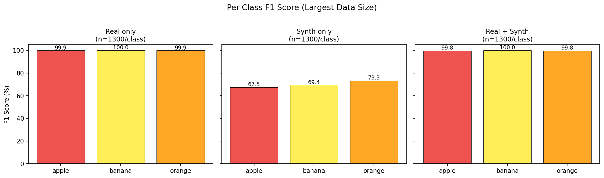

At \(N=1300\), real-only and real+synthetic achieve near-perfect per-class F1, while synthetic-only shows markedly lower F1 across all classes, consistent with the synthetic-to-real domain gap.

For completeness, the synthetic-only per-class metrics at \(N=1300\) are:

| Class | Precision | Recall | F1 |
|---|---:|---:|---:|
| apple | 0.5241 | 0.9492 | 0.6753 |
| banana | 0.9673 | 0.5407 | 0.6936 |
| orange | 0.9484 | 0.5976 | 0.7332 |

These asymmetric precision/recall patterns suggest that the classifier trained on synthetic data learns decision boundaries that do not align well with real image statistics (e.g., “apple” appears over-predicted with high recall but low precision).

# 7. Discussion

## 7.1 When and why synthetic data can help

Synthetic augmentation is most promising when the downstream model suffers from insufficient real data. In this study, the real-only classifier already achieves ≈98.6% accuracy at \(N=100\), indicating that the task is close to saturation even with relatively little data. This reduces the likelihood that any augmentation method (synthetic or conventional) can deliver large absolute gains.

Nevertheless, the result at \(N=400\) suggests that synthetic images can sometimes act as a regularizer or diversity booster when combined with real data. A plausible explanation is that the additional synthetic samples encourage the classifier to learn features that generalize across more varied appearances, *provided* the synthetic distribution is not too far from the real one.

## 7.2 Why synthetic-only training underperforms

The synthetic-only scenario can fail for several reasons:

1. **Domain mismatch.** The generator may capture some aspects of fruit appearance but miss others (texture, edges, lighting, or background cues). The classifier may learn synthetic-specific shortcuts.
2. **Limited diversity.** Even if images look plausible, the synthetic set may have reduced intra-class variety or repeated patterns, causing poor generalization.
3. **Metric mismatch.** FID measures similarity in Inception feature space for the overall distribution and does not guarantee that class-specific discriminative features match those in the real test set.

The sharp decline in synthetic-only accuracy at \(N=1300\) is especially notable. This indicates that adding more synthetic images does not necessarily improve real-world performance; in fact, it can amplify synthetic biases if the synthetic distribution is systematically different from the real distribution.

## 7.3 Relationship between FID and downstream utility

This work illustrates a key practical lesson: **improving FID does not guarantee improved downstream performance**, especially for a classifier evaluated on real images.

Possible reasons:

- FID is computed on **unlabeled mixture distributions**; class-specific quality differences may be hidden.
- FID depends on a feature extractor trained on ImageNet; fruit domain features may not align perfectly.
- The evaluation split size (477 images) is smaller than the desired sample count, potentially increasing variance.

Therefore, the recommended practice is to treat FID as a *monitoring tool* rather than a definitive performance guarantee, and always include downstream evaluations for the intended use case.

## 7.4 Cost–performance trade-off

The experiment grid reports training time as a proxy for computational cost. Two patterns are clear:

- Training time scales approximately linearly with the number of training examples.
- The real+synthetic scenario is consistently the most expensive because it uses more total images.

Given the near-ceiling accuracy of the real-only model at small \(N\), the additional compute required for training with synthetic images may not be justified unless the setting changes (harder dataset, more classes, more realistic backgrounds, or a stricter generalization requirement).

## 7.5 Practical recommendations

Based on the observed results and known synthetic data pitfalls, the following practices are recommended for future iterations:

1. **Always include a real-only baseline.** Synthetic augmentation should be evaluated as a delta over real-only training, not as a stand-alone method.
2. **Prefer mixed-domain training over synthetic-only.** Synthetic-only performance can be misleadingly high on synthetic validation but fail on real test data.
3. **Measure uncertainty.** Multi-seed repeats (mean ± std) are essential for claiming reliable improvements.
4. **Use multiple metrics.** Combine FID with class-conditional checks and downstream evaluations; consider KID or diversity metrics when possible.
5. **Inspect failure cases.** When synthetic-only fails, examine misclassified real images and inspect synthetic artifacts to identify systematic mismatches.

## 7.6 Interpreting the synthetic-only degradation at larger N

The synthetic-only scenario displays a counterintuitive pattern: accuracy is relatively high at small synthetic dataset sizes (e.g., 93.16% at \(N=100\)) but declines substantially when training on the full synthetic pool (69.58% at \(N=1300\)). Several mechanisms can produce this behavior without contradicting basic learning theory:

1. **Amplified shortcut learning.** With more synthetic samples, the classifier can become more confident in synthetic-specific cues (textures, edge artifacts, color statistics) that do not hold for real images. With fewer synthetic samples, the classifier may not fully exploit these shortcuts and may rely on more general features.
2. **Style concentration.** If the generator produces a limited set of “styles” (even across many samples), increasing dataset size does not increase true diversity; it increases repeated exposure to the same synthetic biases.
3. **Optimization interactions.** The training schedule is fixed in epochs. Larger datasets increase the number of gradient updates, which can improve fit to the synthetic distribution while simultaneously worsening transfer to the real domain.
4. **Label-conditional mismatches.** Synthetic images may be globally plausible, yet class-discriminative details may be subtly wrong (e.g., apple shape vs orange texture). Such mismatches can cause systematic confusion when evaluated on real images.

These hypotheses motivate follow-up diagnostics such as feature-space nearest-neighbor analysis (real vs synthetic), per-class FID/KID, and saving misclassified test examples for qualitative inspection.

# 8. Limitations

This report is intended to be rigorous, but several limitations affect the strength and generality of conclusions.

## 8.1 Internal validity (experimental uncertainty)

- **Single-seed evaluation.** GAN training and classifier training use one random seed (`seed=42`). Given the known variance of GAN training dynamics, multi-seed evaluation is necessary for statistically robust claims.
- **No confidence intervals.** Accuracy and FID are reported as point estimates. Without repeated trials, it is unclear whether small differences (e.g., ±0.5 percentage points) are meaningful.

## 8.2 Construct validity (are we measuring the right things?)

- **FID is an imperfect proxy.** FID is computed on a limited validation set and uses an ImageNet-pretrained feature extractor. It does not directly measure class-conditional correctness or utility for classification.
- **Mixture-level evaluation.** FID is computed on the mixture of all classes rather than per-class; class-specific failures may be hidden.

## 8.3 External validity (generalization to other settings)

- **Dataset simplicity.** The real-only classifier reaches near-ceiling performance at small \(N\), limiting the observable benefit of augmentation. On harder datasets, synthetic augmentation effects could differ.
- **Few classes and low resolution.** Only three classes at 64×64 are studied. Conclusions may not transfer to higher-resolution or higher-class-count problems.

## 8.4 Methodological coverage

- **Single generative model family.** Only one CGAN architecture is evaluated. Stronger baselines (e.g., ADA-style training or style-based generators) may alter the synthetic-only gap and augmentation benefits.
- **No explicit domain alignment.** The pipeline does not include techniques that reduce synthetic–real shift (domain adaptation, feature alignment, or discriminator guidance targeted at downstream features).

# 9. Future Work

1. **Multi-seed robustness.** Repeat the full grid across multiple seeds and report mean ± std for accuracy and FID.
2. **Stronger generative baselines.** Evaluate more modern methods (e.g., StyleGAN2 with ADA) and compare against the current CGAN.
3. **Per-class evaluation.** Compute FID per class and analyze which class drives synthetic-only failures (e.g., apples vs bananas).
4. **Alternative metrics.** Add KID and diversity-sensitive measures; consider classifier-based precision/recall for generative models.
5. **Better synthetic–real alignment.** Explore domain adaptation, feature matching, or training classifiers with mixed-domain regularization.
6. **Human or task-specific evaluations.** For practical deployments, evaluate whether synthetic data improve robustness to nuisance factors (lighting, backgrounds).

Additional concrete extensions that would strengthen the scientific quality of the study include:

7. **Checkpoint–utility sweep.** Instead of selecting a single best-FID checkpoint, generate synthetic pools from multiple epochs (e.g., 50/100/140/200) and measure downstream utility to empirically test FID–utility alignment.
8. **Augmentation baselines.** Compare synthetic augmentation against strong classical baselines (RandAugment, MixUp/CutMix) to contextualize gains.
9. **Error analysis.** Save confusion matrices and example misclassifications to diagnose whether errors are due to specific classes, lighting, or pose.
10. **Diversity diagnostics.** Measure intra-class diversity in the synthetic pool (nearest-neighbor distances in feature space) to detect memorization or repeated patterns.

# 10. Conclusion

This report implemented and evaluated an end-to-end synthetic data pipeline: training a CGAN to generate class-conditional fruit images, selecting checkpoints using FID, generating a balanced synthetic pool, and testing its downstream impact on classification across a data-size grid.

The CGAN’s intrinsic quality improved over training according to FID, achieving its best value at epoch 140. However, downstream experiments showed that synthetic data alone do not reliably transfer to real test images, and that synthetic augmentation provides only limited benefits in a regime where real-only performance is already near ceiling. The results reinforce a central principle for synthetic data: **utility must be validated in the target task**, and intrinsic generative metrics should be interpreted as supportive signals rather than final objectives.

# References

- Goodfellow, I., Pouget-Abadie, J., Mirza, M., Xu, B., Warde-Farley, D., Ozair, S., Courville, A., & Bengio, Y. (2014). *Generative Adversarial Nets*. NeurIPS.
- Mirza, M., & Osindero, S. (2014). *Conditional Generative Adversarial Nets*. arXiv:1411.1784.
- Radford, A., Metz, L., & Chintala, S. (2016). *Unsupervised Representation Learning with Deep Convolutional Generative Adversarial Networks*. ICLR.
- Miyato, T., & Koyama, M. (2018). *cGANs with Projection Discriminator*. arXiv:1802.05637.
- Heusel, M., Ramsauer, H., Unterthiner, T., Nessler, B., & Hochreiter, S. (2017). *GANs Trained by a Two Time-Scale Update Rule Converge to a Local Nash Equilibrium*. NeurIPS.
- Salimans, T., Goodfellow, I., Zaremba, W., Cheung, V., Radford, A., & Chen, X. (2016). *Improved Techniques for Training GANs*. NeurIPS.
- Karras, T., Aittala, M., Laine, S., Härkönen, E., Hellsten, J., Lehtinen, J., & Aila, T. (2020). *Training Generative Adversarial Networks with Limited Data*. NeurIPS.

# Appendix A — Reproducibility

This appendix describes how to regenerate the tables and figures used in the report, and how to rerun experiments (assuming the required Python packages are installed).

## A.1 Environment setup

The repository includes an unpinned dependency list in `requirements.txt`. A typical setup is:

```bash
python -m venv .venv
source .venv/bin/activate
pip install -r requirements.txt
```

**Apple Silicon note.** The training scripts default to `device="mps"` if available; otherwise they fall back to CPU. If MPS is unavailable, set the device in `config.py` or rely on the fallback.

## A.2 Regenerate report tables (CSV)

```bash
python scripts/export_report_tables.py
```

This writes:

- `reports/tables/dataset_summary.csv`
- `reports/tables/gan_fid_by_epoch.csv`
- `reports/tables/clf_results.csv`

## A.3 Regenerate the FID plot (SVG)

```bash
python scripts/plot_fid_svg.py
```

This writes:

- `reports/figures/fid_vs_epoch.svg`

## A.4 Train the CGAN

```bash
python train_gan.py
```

Outputs:

- `runs/gan/train_log.json`
- `runs/gan/samples_epoch*.png`
- `runs/gan/checkpoints/*.pt`

## A.5 Generate a synthetic image pool

Choose a generator checkpoint (for example, the best-FID checkpoint):

```bash
python scripts/generate_synth.py --ckpt runs/gan/checkpoints/best_fid.pt --n_per_class 1300 --out_dir data_synth
```

Outputs:

- `data_synth/apple/*.png`
- `data_synth/banana/*.png`
- `data_synth/orange/*.png`

## A.6 Run the classifier experiments

Single run (example):

```bash
python train_classifier.py --scenario both --n_per_class 400 --synth_dir data_synth --out_dir runs/clf
```

Full grid (all sizes, all scenarios):

```bash
python scripts/run_experiments.py
```

Plot classifier results (requires matplotlib):

```bash
python scripts/plot_results.py --results runs/clf/all_results.json --out_dir runs/clf/plots
```

# Appendix B — Hyperparameters

This section summarizes key hyperparameters as configured in `config.py` and used by the training scripts.

## B.1 Core settings

| Setting | Value |
|---|---:|
| Seed | 42 |
| Image size (training) | 64×64 |
| Channels | 3 |
| Output root | `runs/` |

## B.2 GAN (CGAN) settings

| Setting | Value |
|---|---:|
| Latent dimension (`z_dim`) | 128 |
| Batch size (`gan_batch`) | 96 |
| Epochs (`gan_epochs`) | 200 |
| Generator LR (`gan_lr_g`) | 2e-4 |
| Discriminator LR (`gan_lr_d`) | 1e-4 |
| Adam betas | (0.5, 0.999) |
| Sample grid every | 10 epochs |
| Checkpoint every | 25 epochs |
| FID every | 10 epochs |
| FID requested samples | 2048 (limited by split size in practice) |
| FID eval split | `val` |

## B.3 Classifier settings

| Setting | Value |
|---|---:|
| Batch size (`clf_batch`) | 64 |
| Epochs (`clf_epochs`) | 50 |
| LR (`clf_lr`) | 3e-4 |
| Optimizer | Adam |
| Scheduler | CosineAnnealingLR |
| Loss | CrossEntropyLoss |

## B.4 DataLoader / device defaults

| Setting | Value |
|---|---|
| Device (default) | `mps` (fallback to CPU if unavailable) |
| Workers (`num_workers`) | `min(5, max(1, cpu_count//2))` |
| Persistent workers | True |
| Prefetch factor | 2 |

# Appendix C — Repository Structure

Key files and directories:

- `config.py` — central configuration (paths, hyperparameters, device defaults)
- `models/gan.py` — CGAN generator + projection discriminator
- `models/classifier.py` — FruitCNN classifier
- `train_gan.py` — CGAN training + FID evaluation + checkpoints/samples
- `train_classifier.py` — classifier training and evaluation (real/synth/both, data-size control)
- `scripts/generate_synth.py` — generate synthetic pools from a trained generator checkpoint
- `scripts/run_experiments.py` — run the full classifier experiment grid
- `scripts/plot_results.py` — generate classifier plots (accuracy/time/per-class F1)
- `scripts/export_report_tables.py` — export CSV tables for the report (stdlib-only)
- `scripts/plot_fid_svg.py` — generate `fid_vs_epoch.svg` for the report (stdlib-only)
- `runs/` — experiment outputs (GAN logs/checkpoints/samples; classifier JSON results/plots)
- `reports/` — this report and its copied figures/tables for a self-contained hand-in
